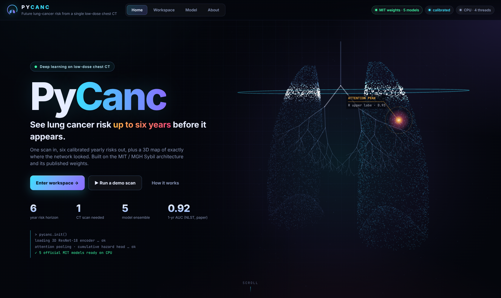
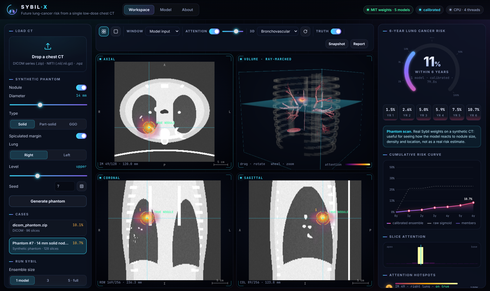

# PyCanc — lung-cancer risk from a single low-dose CT

Built on **Sybil** (Mikhael, Wohlwend, Yala, Barzilay, Fintelmann, Sequist et al.,
*J Clin Oncol* 2023 — MIT Jameel Clinic & Massachusetts General Hospital). Sybil predicts a person's risk of
lung cancer for each of the next **1–6 years** from a **single low-dose chest CT**.

PyCanc is a from-scratch re-implementation of that model, plus a full imaging workstation. It includes:

* **The network, layer for layer.** It is built on a 3D ResNet-18 encoder, uses multi-attention pooling, and ends in a
  cumulative-hazard head. Parameter names match the reference code, so the **5 official MIT checkpoints and their
  calibrators load unchanged** (`strict=True`).
* **The exact preprocessing chain.** DICOM → HU → lung window → 8-bit → 256² → normalise → resample to
  0.703×0.703×2.5 mm → crop/pad to 200 slices.
* **Ensembling and calibration.** Up to 5 models are averaged, then Platt + isotonic calibration is applied per year.
* **Attention explanations.** The model's own spatial × slice attention is turned into a 3D heat-map, and its peaks
  are listed as hotspots.
* **PyCanc workstation.** It opens on an animated welcome screen (particle lungs, scanning beam, attention-peak callout), then leads into a GPU-rendered web app with linked axial, coronal and sagittal views, a WebGL2
  ray-marched 3D volume with five render modes, attention overlays and an animated risk gauge and curve. It also
  includes slice-attention profiles, hotspot navigation, PNG snapshots and printable reports.
* **A procedural chest-CT phantom.** It has vessels, airways, ribs, heart and a configurable nodule, so you can try
  everything without patient data.
* **Training code** with the paper's objectives (masked survival BCE plus attention guidance from nodule boxes).




## Quick start

```bash
cd pycanc
pip install -r requirements.txt

# 1. get the official MIT weights (~700 MB, from github.com/reginabarzilaygroup/Sybil releases)
python -m pycanc.cli download            # saved to ~/.pycanc (override with PYCANC_CHECKPOINT_DIR)

# 2. launch the workstation
python -m pycanc.cli serve               # → http://127.0.0.1:8000
```

You can also get the weights from inside the app: click **Get official weights** in the top bar.
Without the weights the architecture still runs, but its weights are untrained and the UI flags every result as meaningless.

If you already downloaded weights into `~/.sybil` with an earlier version, PyCanc finds and uses them automatically.

### Command line

```bash
python -m pycanc.cli predict path/to/dicom_folder_or.zip      # or .nii / .nii.gz / .npz
python -m pycanc.cli predict --phantom --models 5 --json
```

```
PyCanc · 1 model(s) · calibrated · 55.5 s
  year 1:   1.48%  ███
  year 2:   2.57%  █████
  ...
  year 6:  10.65%  █████████████████████
  top attention: slice 84 (R) 1.00, ...
```

### Python

```python
from pycanc import load_any, preprocess
from pycanc.predict import PyCancEngine

engine = PyCancEngine()                  # loads ~/.pycanc/*.ckpt (GPU if available)
result = engine.predict(preprocess(load_any("scan.zip")))
print(result["risk"])                    # calibrated P(cancer within 1..6 years)
```

## Using the workstation

| Action | How |
|---|---|
| Load a scan | Drag a zipped DICOM series, a NIfTI file or an `.npz` (`hu`, `spacing`) onto **Load CT** |
| Synthetic case | Set nodule size, type (solid / part-solid / GGO), margin, lung and level, then **Generate phantom** |
| Run PyCanc | Pick an ensemble size and press **▶ Predict** (about 60 s per model on CPU; a few seconds on GPU) |
| Navigate | Click or drag to move the crosshair, use the wheel or ↑/↓ to scroll slices, double-click a view to maximise it |
| 3D | Drag to orbit and scroll to zoom. Modes: Bronchovascular · Skeleton + lungs · Soft tissue · MIP · Attention focus |
| Explain | Toggle the attention overlay and opacity, click hotspots or the slice-attention bars to jump to them |
| Export | **Snapshot** saves a PNG of all four views. **Report** opens a printable PDF-ready summary |

## How faithful is it?

Checked against the official release (v1.5.0 checkpoints):

* All 136 tensors of every checkpoint load with `strict=True`, with no missing or unexpected keys.
* Preprocessing constants come from the checkpoints' saved `args`: `img_size [256,256]`, `num_images 200`,
  `img_mean 128.1722`, `img_std 87.1849`, `max_followup 6`, `resample_pixel_spacing`, lung window −600/1500.
* On the synthetic phantom, the official weights put their top attention peak within about 2 voxels of the
  inserted nodule. 6-year risk rises from 6.2% (no nodule) to 10.7% (14 mm spiculated nodule), using a single
  model with calibration.

Known simplifications: the DICOM reader keeps the largest series and does not apply Sybil's slice-thickness filter.
Subset ensembles (2–4 models) reuse the 5-model calibrator. Inputs whose in-plane matrix is not 512 are rescaled to a
nominal 512 grid before resampling.

## Project layout

```
pycanc/
  model.py       PyCancNet: r3d_18 encoder, MultiAttentionPool, Cumulative_Probability_Layer
  preprocess.py  readers (DICOM / NIfTI / npz), Sybil preprocessing, lung mask, coordinate mapping
  weights.py     checkpoint download, safe loading, isotonic calibrators
  predict.py     PyCancEngine: ensemble inference, calibration, attention maps, hotspots
  phantom.py     procedural low-dose chest CT with a configurable nodule
  train.py       survival + attention-guided training / fine-tuning, C-index evaluation
  cli.py         download / predict / serve
web/
  server.py      FastAPI backend (cases, volumes, background inference jobs, weight download)
  static/        UI: welcome.js (hero animation), app.js (MPR, charts), volume.js (WebGL2 ray-marcher), style.css
tests/           pytest suite (shapes, monotone hazards, labels, losses, preprocessing)
```

## Training

```bash
python -m pycanc.train --csv train.csv --val-csv val.csv --epochs 10        # from Kinetics-400 init
python -m pycanc.train --csv train.csv --init ~/.pycanc/28a7cd44f5bcd3e6cc760b65c7e0d54d.ckpt   # fine-tune
python -m pycanc.train --demo                                               # tiny CPU smoke test
```

The CSV needs these columns: `path, years_to_cancer, years_to_last_followup`, plus an optional `mask_path` (an `.npz` with a
nodule `mask`) for the attention loss. Full-resolution training needs a GPU. Use `--amp` and gradient accumulation.

## Disclaimer

Research and education only. This is **not a medical device** and must not be used for diagnosis or clinical
decisions. Sybil was validated on screening LDCTs (NLST, MGH, CGMH). Outputs on other scans, on phantoms, or without
the official weights have no clinical meaning. The original model and weights are by the Barzilay lab at MIT; see
<https://github.com/reginabarzilaygroup/Sybil> for their license and terms.
